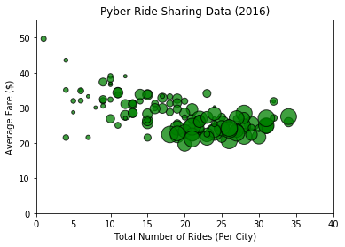

# Pyber Ride Sharing

Analysis

* Fare costs skew higher in rural areas, however total rides are much lower (5.2%) compared to suburban (27.3%) and urban (67.5%) city types.

* Urban leads in terms of % total rides (67.5%), % of total fares (62%), and % of total drivers (77.8%).

* Suburban ranked in between urban and rural in terms of number of rides per city, with only one outlier city above 30 rides total (Port James = 32).


```python
# Dependencies
import matplotlib.pyplot as plt
import pandas as pd
import numpy as np
```


```python
# Take in all of our ride sharing data and read it into pandas
ride_data = "ride_data.csv"
city_data = "city_data.csv"

ride_data_df = pd.read_csv(ride_data)
city_data_df = pd.read_csv(city_data)
```


```python
# Merge the first two datasets on "City"
combined_data_df = pd.merge(ride_data_df, city_data_df, how="outer", on="city")
combined_data_df.head()
```


<div>
<style>
    .dataframe thead tr:only-child th {
        text-align: right;
    }

    .dataframe thead th {
        text-align: left;
    }

    .dataframe tbody tr th {
        vertical-align: top;
    }
</style>
<table border="1" class="dataframe">
  <thead>
    <tr style="text-align: right;">
      <th></th>
      <th>city</th>
      <th>date</th>
      <th>fare</th>
      <th>ride_id</th>
      <th>driver_count</th>
      <th>type</th>
    </tr>
  </thead>
  <tbody>
    <tr>
      <th>0</th>
      <td>Sarabury</td>
      <td>2016-01-16 13:49:27</td>
      <td>38.35</td>
      <td>5403689035038</td>
      <td>46</td>
      <td>Urban</td>
    </tr>
    <tr>
      <th>1</th>
      <td>Sarabury</td>
      <td>2016-07-23 07:42:44</td>
      <td>21.76</td>
      <td>7546681945283</td>
      <td>46</td>
      <td>Urban</td>
    </tr>
    <tr>
      <th>2</th>
      <td>Sarabury</td>
      <td>2016-04-02 04:32:25</td>
      <td>38.03</td>
      <td>4932495851866</td>
      <td>46</td>
      <td>Urban</td>
    </tr>
    <tr>
      <th>3</th>
      <td>Sarabury</td>
      <td>2016-06-23 05:03:41</td>
      <td>26.82</td>
      <td>6711035373406</td>
      <td>46</td>
      <td>Urban</td>
    </tr>
    <tr>
      <th>4</th>
      <td>Sarabury</td>
      <td>2016-09-30 12:48:34</td>
      <td>30.30</td>
      <td>6388737278232</td>
      <td>46</td>
      <td>Urban</td>
    </tr>
  </tbody>
</table>
</div>


```python
# Add total rides
combined_data_df["total_rides"] = 1
combined_data_df.head()
```


<div>
<style>
    .dataframe thead tr:only-child th {
        text-align: right;
    }

    .dataframe thead th {
        text-align: left;
    }

    .dataframe tbody tr th {
        vertical-align: top;
    }
</style>
<table border="1" class="dataframe">
  <thead>
    <tr style="text-align: right;">
      <th></th>
      <th>city</th>
      <th>date</th>
      <th>fare</th>
      <th>ride_id</th>
      <th>driver_count</th>
      <th>type</th>
      <th>total_rides</th>
    </tr>
  </thead>
  <tbody>
    <tr>
      <th>0</th>
      <td>Sarabury</td>
      <td>2016-01-16 13:49:27</td>
      <td>38.35</td>
      <td>5403689035038</td>
      <td>46</td>
      <td>Urban</td>
      <td>1</td>
    </tr>
    <tr>
      <th>1</th>
      <td>Sarabury</td>
      <td>2016-07-23 07:42:44</td>
      <td>21.76</td>
      <td>7546681945283</td>
      <td>46</td>
      <td>Urban</td>
      <td>1</td>
    </tr>
    <tr>
      <th>2</th>
      <td>Sarabury</td>
      <td>2016-04-02 04:32:25</td>
      <td>38.03</td>
      <td>4932495851866</td>
      <td>46</td>
      <td>Urban</td>
      <td>1</td>
    </tr>
    <tr>
      <th>3</th>
      <td>Sarabury</td>
      <td>2016-06-23 05:03:41</td>
      <td>26.82</td>
      <td>6711035373406</td>
      <td>46</td>
      <td>Urban</td>
      <td>1</td>
    </tr>
    <tr>
      <th>4</th>
      <td>Sarabury</td>
      <td>2016-09-30 12:48:34</td>
      <td>30.30</td>
      <td>6388737278232</td>
      <td>46</td>
      <td>Urban</td>
      <td>1</td>
    </tr>
  </tbody>
</table>
</div>


```python
# Total Number of Drivers Per City and City Type
total_drivers = combined_data_df.groupby(['city', 'driver_count', 'type'])
sum_drivers_df = total_drivers.sum()
sum_drivers_df.head()
```


<div>
<style>
    .dataframe thead tr:only-child th {
        text-align: right;
    }

    .dataframe thead th {
        text-align: left;
    }

    .dataframe tbody tr th {
        vertical-align: top;
    }
</style>
<table border="1" class="dataframe">
  <thead>
    <tr style="text-align: right;">
      <th></th>
      <th></th>
      <th></th>
      <th>fare</th>
      <th>ride_id</th>
      <th>total_rides</th>
    </tr>
    <tr>
      <th>city</th>
      <th>driver_count</th>
      <th>type</th>
      <th></th>
      <th></th>
      <th></th>
    </tr>
  </thead>
  <tbody>
    <tr>
      <th>Alvarezhaven</th>
      <th>21</th>
      <th>Urban</th>
      <td>741.79</td>
      <td>165899161874789</td>
      <td>31</td>
    </tr>
    <tr>
      <th>Alyssaberg</th>
      <th>67</th>
      <th>Urban</th>
      <td>535.85</td>
      <td>91953627077845</td>
      <td>26</td>
    </tr>
    <tr>
      <th>Anitamouth</th>
      <th>16</th>
      <th>Suburban</th>
      <td>335.84</td>
      <td>37762826439863</td>
      <td>9</td>
    </tr>
    <tr>
      <th>Antoniomouth</th>
      <th>21</th>
      <th>Urban</th>
      <td>519.75</td>
      <td>111909606921566</td>
      <td>22</td>
    </tr>
    <tr>
      <th>Aprilchester</th>
      <th>49</th>
      <th>Urban</th>
      <td>417.65</td>
      <td>86920968698689</td>
      <td>19</td>
    </tr>
  </tbody>
</table>
</div>


```python
sum_drivers_df["avg_fare"] = total_drivers["fare"].sum() / total_drivers["ride_id"].count() 
sum_drivers_df.head()
```


<div>
<style>
    .dataframe thead tr:only-child th {
        text-align: right;
    }

    .dataframe thead th {
        text-align: left;
    }

    .dataframe tbody tr th {
        vertical-align: top;
    }
</style>
<table border="1" class="dataframe">
  <thead>
    <tr style="text-align: right;">
      <th></th>
      <th></th>
      <th></th>
      <th>fare</th>
      <th>ride_id</th>
      <th>total_rides</th>
      <th>avg_fare</th>
    </tr>
    <tr>
      <th>city</th>
      <th>driver_count</th>
      <th>type</th>
      <th></th>
      <th></th>
      <th></th>
      <th></th>
    </tr>
  </thead>
  <tbody>
    <tr>
      <th>Alvarezhaven</th>
      <th>21</th>
      <th>Urban</th>
      <td>741.79</td>
      <td>165899161874789</td>
      <td>31</td>
      <td>23.928710</td>
    </tr>
    <tr>
      <th>Alyssaberg</th>
      <th>67</th>
      <th>Urban</th>
      <td>535.85</td>
      <td>91953627077845</td>
      <td>26</td>
      <td>20.609615</td>
    </tr>
    <tr>
      <th>Anitamouth</th>
      <th>16</th>
      <th>Suburban</th>
      <td>335.84</td>
      <td>37762826439863</td>
      <td>9</td>
      <td>37.315556</td>
    </tr>
    <tr>
      <th>Antoniomouth</th>
      <th>21</th>
      <th>Urban</th>
      <td>519.75</td>
      <td>111909606921566</td>
      <td>22</td>
      <td>23.625000</td>
    </tr>
    <tr>
      <th>Aprilchester</th>
      <th>49</th>
      <th>Urban</th>
      <td>417.65</td>
      <td>86920968698689</td>
      <td>19</td>
      <td>21.981579</td>
    </tr>
  </tbody>
</table>
</div>


```python
sum_drivers_df.head()
```


<div>
<style>
    .dataframe thead tr:only-child th {
        text-align: right;
    }

    .dataframe thead th {
        text-align: left;
    }

    .dataframe tbody tr th {
        vertical-align: top;
    }
</style>
<table border="1" class="dataframe">
  <thead>
    <tr style="text-align: right;">
      <th></th>
      <th></th>
      <th></th>
      <th>fare</th>
      <th>ride_id</th>
      <th>total_rides</th>
      <th>avg_fare</th>
    </tr>
    <tr>
      <th>city</th>
      <th>driver_count</th>
      <th>type</th>
      <th></th>
      <th></th>
      <th></th>
      <th></th>
    </tr>
  </thead>
  <tbody>
    <tr>
      <th>Alvarezhaven</th>
      <th>21</th>
      <th>Urban</th>
      <td>741.79</td>
      <td>165899161874789</td>
      <td>31</td>
      <td>23.928710</td>
    </tr>
    <tr>
      <th>Alyssaberg</th>
      <th>67</th>
      <th>Urban</th>
      <td>535.85</td>
      <td>91953627077845</td>
      <td>26</td>
      <td>20.609615</td>
    </tr>
    <tr>
      <th>Anitamouth</th>
      <th>16</th>
      <th>Suburban</th>
      <td>335.84</td>
      <td>37762826439863</td>
      <td>9</td>
      <td>37.315556</td>
    </tr>
    <tr>
      <th>Antoniomouth</th>
      <th>21</th>
      <th>Urban</th>
      <td>519.75</td>
      <td>111909606921566</td>
      <td>22</td>
      <td>23.625000</td>
    </tr>
    <tr>
      <th>Aprilchester</th>
      <th>49</th>
      <th>Urban</th>
      <td>417.65</td>
      <td>86920968698689</td>
      <td>19</td>
      <td>21.981579</td>
    </tr>
  </tbody>
</table>
</div>


```python
# Drop ride_id and fare columns
sum_drivers_df = sum_drivers_df.drop('ride_id', 1)
sum_drivers_df.head()
```


<div>
<style>
    .dataframe thead tr:only-child th {
        text-align: right;
    }

    .dataframe thead th {
        text-align: left;
    }

    .dataframe tbody tr th {
        vertical-align: top;
    }
</style>
<table border="1" class="dataframe">
  <thead>
    <tr style="text-align: right;">
      <th></th>
      <th></th>
      <th></th>
      <th>fare</th>
      <th>total_rides</th>
      <th>avg_fare</th>
    </tr>
    <tr>
      <th>city</th>
      <th>driver_count</th>
      <th>type</th>
      <th></th>
      <th></th>
      <th></th>
    </tr>
  </thead>
  <tbody>
    <tr>
      <th>Alvarezhaven</th>
      <th>21</th>
      <th>Urban</th>
      <td>741.79</td>
      <td>31</td>
      <td>23.928710</td>
    </tr>
    <tr>
      <th>Alyssaberg</th>
      <th>67</th>
      <th>Urban</th>
      <td>535.85</td>
      <td>26</td>
      <td>20.609615</td>
    </tr>
    <tr>
      <th>Anitamouth</th>
      <th>16</th>
      <th>Suburban</th>
      <td>335.84</td>
      <td>9</td>
      <td>37.315556</td>
    </tr>
    <tr>
      <th>Antoniomouth</th>
      <th>21</th>
      <th>Urban</th>
      <td>519.75</td>
      <td>22</td>
      <td>23.625000</td>
    </tr>
    <tr>
      <th>Aprilchester</th>
      <th>49</th>
      <th>Urban</th>
      <td>417.65</td>
      <td>19</td>
      <td>21.981579</td>
    </tr>
  </tbody>
</table>
</div>


# Bubble Plot of Ride Sharing Data


```python
final_df = sum_drivers_df.reset_index()
```


```python
final_df.head()
```


<div>
<style>
    .dataframe thead tr:only-child th {
        text-align: right;
    }

    .dataframe thead th {
        text-align: left;
    }

    .dataframe tbody tr th {
        vertical-align: top;
    }
</style>
<table border="1" class="dataframe">
  <thead>
    <tr style="text-align: right;">
      <th></th>
      <th>city</th>
      <th>driver_count</th>
      <th>type</th>
      <th>fare</th>
      <th>total_rides</th>
      <th>avg_fare</th>
    </tr>
  </thead>
  <tbody>
    <tr>
      <th>0</th>
      <td>Alvarezhaven</td>
      <td>21</td>
      <td>Urban</td>
      <td>741.79</td>
      <td>31</td>
      <td>23.928710</td>
    </tr>
    <tr>
      <th>1</th>
      <td>Alyssaberg</td>
      <td>67</td>
      <td>Urban</td>
      <td>535.85</td>
      <td>26</td>
      <td>20.609615</td>
    </tr>
    <tr>
      <th>2</th>
      <td>Anitamouth</td>
      <td>16</td>
      <td>Suburban</td>
      <td>335.84</td>
      <td>9</td>
      <td>37.315556</td>
    </tr>
    <tr>
      <th>3</th>
      <td>Antoniomouth</td>
      <td>21</td>
      <td>Urban</td>
      <td>519.75</td>
      <td>22</td>
      <td>23.625000</td>
    </tr>
    <tr>
      <th>4</th>
      <td>Aprilchester</td>
      <td>49</td>
      <td>Urban</td>
      <td>417.65</td>
      <td>19</td>
      <td>21.981579</td>
    </tr>
  </tbody>
</table>
</div>


```python
# Label Scatter Plot
x_lim = 50
x_axis = np.arange(0, x_lim, 1)
plt.ylabel('Average Fare ($)')
plt.xlabel('Total Number of Rides (Per City)')
plt.title('Pyber Ride Sharing Data (2016)')
s = 5*final_df["driver_count"]


# The y limits of our scatter plot is 0 to 55
plt.ylim(0, 55)

# The x limits of our scatter plot is 0 to 40
plt.xlim(0, 40)
```


    (0, 40)


```python
# Tells matplotlib that we want to make a scatter plot
# The size of each point on our plot is determined by their x value
x = final_df.total_rides
y= final_df.avg_fare
a = plt.scatter(x, y, s=s, marker="o", color="green", edgecolors="black", alpha=0.75)
    
```


```python
plt.show(a)
```





```python
# create Urban dataframe
urban_df = final_df.loc[final_df.type=="Urban"]
urban_df.head()
```


<div>
<style>
    .dataframe thead tr:only-child th {
        text-align: right;
    }

    .dataframe thead th {
        text-align: left;
    }

    .dataframe tbody tr th {
        vertical-align: top;
    }
</style>
<table border="1" class="dataframe">
  <thead>
    <tr style="text-align: right;">
      <th></th>
      <th>city</th>
      <th>driver_count</th>
      <th>type</th>
      <th>fare</th>
      <th>total_rides</th>
      <th>avg_fare</th>
    </tr>
  </thead>
  <tbody>
    <tr>
      <th>0</th>
      <td>Alvarezhaven</td>
      <td>21</td>
      <td>Urban</td>
      <td>741.79</td>
      <td>31</td>
      <td>23.928710</td>
    </tr>
    <tr>
      <th>1</th>
      <td>Alyssaberg</td>
      <td>67</td>
      <td>Urban</td>
      <td>535.85</td>
      <td>26</td>
      <td>20.609615</td>
    </tr>
    <tr>
      <th>3</th>
      <td>Antoniomouth</td>
      <td>21</td>
      <td>Urban</td>
      <td>519.75</td>
      <td>22</td>
      <td>23.625000</td>
    </tr>
    <tr>
      <th>4</th>
      <td>Aprilchester</td>
      <td>49</td>
      <td>Urban</td>
      <td>417.65</td>
      <td>19</td>
      <td>21.981579</td>
    </tr>
    <tr>
      <th>5</th>
      <td>Arnoldview</td>
      <td>41</td>
      <td>Urban</td>
      <td>778.30</td>
      <td>31</td>
      <td>25.106452</td>
    </tr>
  </tbody>
</table>
</div>


```python
b = plt.scatter(urban_df.total_rides, urban_df.avg_fare, s=s, marker="o", color="lightcoral", edgecolors="black", alpha=0.75)
plt.show(b)
```


```python
# create Rural dataframe
rural_df = final_df.loc[final_df.type=="Rural"]
rural_df.head()
```


<div>
<style>
    .dataframe thead tr:only-child th {
        text-align: right;
    }

    .dataframe thead th {
        text-align: left;
    }

    .dataframe tbody tr th {
        vertical-align: top;
    }
</style>
<table border="1" class="dataframe">
  <thead>
    <tr style="text-align: right;">
      <th></th>
      <th>city</th>
      <th>driver_count</th>
      <th>type</th>
      <th>fare</th>
      <th>total_rides</th>
      <th>avg_fare</th>
    </tr>
  </thead>
  <tbody>
    <tr>
      <th>17</th>
      <td>East Leslie</td>
      <td>9</td>
      <td>Rural</td>
      <td>370.27</td>
      <td>11</td>
      <td>33.660909</td>
    </tr>
    <tr>
      <th>18</th>
      <td>East Stephen</td>
      <td>6</td>
      <td>Rural</td>
      <td>390.53</td>
      <td>10</td>
      <td>39.053000</td>
    </tr>
    <tr>
      <th>19</th>
      <td>East Troybury</td>
      <td>3</td>
      <td>Rural</td>
      <td>232.71</td>
      <td>7</td>
      <td>33.244286</td>
    </tr>
    <tr>
      <th>21</th>
      <td>Erikport</td>
      <td>3</td>
      <td>Rural</td>
      <td>240.35</td>
      <td>8</td>
      <td>30.043750</td>
    </tr>
    <tr>
      <th>25</th>
      <td>Hernandezshire</td>
      <td>10</td>
      <td>Rural</td>
      <td>288.02</td>
      <td>9</td>
      <td>32.002222</td>
    </tr>
  </tbody>
</table>
</div>


```python
c = plt.scatter(rural_df.total_rides, rural_df.avg_fare, s=s, marker="o", color="gold", edgecolors="black", alpha=0.75)
plt.show(c)
```


```python
suburban_df = final_df.loc[final_df.type=="Suburban"]
suburban_df.head()
```


<div>
<style>
    .dataframe thead tr:only-child th {
        text-align: right;
    }

    .dataframe thead th {
        text-align: left;
    }

    .dataframe tbody tr th {
        vertical-align: top;
    }
</style>
<table border="1" class="dataframe">
  <thead>
    <tr style="text-align: right;">
      <th></th>
      <th>city</th>
      <th>driver_count</th>
      <th>type</th>
      <th>fare</th>
      <th>total_rides</th>
      <th>avg_fare</th>
    </tr>
  </thead>
  <tbody>
    <tr>
      <th>2</th>
      <td>Anitamouth</td>
      <td>16</td>
      <td>Suburban</td>
      <td>335.84</td>
      <td>9</td>
      <td>37.315556</td>
    </tr>
    <tr>
      <th>6</th>
      <td>Campbellport</td>
      <td>26</td>
      <td>Suburban</td>
      <td>505.67</td>
      <td>15</td>
      <td>33.711333</td>
    </tr>
    <tr>
      <th>7</th>
      <td>Carrollbury</td>
      <td>4</td>
      <td>Suburban</td>
      <td>366.06</td>
      <td>10</td>
      <td>36.606000</td>
    </tr>
    <tr>
      <th>9</th>
      <td>Clarkstad</td>
      <td>21</td>
      <td>Suburban</td>
      <td>372.62</td>
      <td>12</td>
      <td>31.051667</td>
    </tr>
    <tr>
      <th>10</th>
      <td>Conwaymouth</td>
      <td>18</td>
      <td>Suburban</td>
      <td>380.51</td>
      <td>11</td>
      <td>34.591818</td>
    </tr>
  </tbody>
</table>
</div>


```python
d = plt.scatter(suburban_df.total_rides, suburban_df.avg_fare, s=s, marker="o", color="lightskyblue", edgecolors="black", alpha=0.75)
plt.show(d)
```


```python
# Analyze outlier city in Suburban
test = suburban_df.sort_values(['total_rides'], ascending=[False])
test.head(1)
```


<div>
<style>
    .dataframe thead tr:only-child th {
        text-align: right;
    }

    .dataframe thead th {
        text-align: left;
    }

    .dataframe tbody tr th {
        vertical-align: top;
    }
</style>
<table border="1" class="dataframe">
  <thead>
    <tr style="text-align: right;">
      <th></th>
      <th>city</th>
      <th>driver_count</th>
      <th>type</th>
      <th>fare</th>
      <th>total_rides</th>
      <th>avg_fare</th>
    </tr>
  </thead>
  <tbody>
    <tr>
      <th>73</th>
      <td>Port James</td>
      <td>15</td>
      <td>Suburban</td>
      <td>1017.81</td>
      <td>32</td>
      <td>31.806562</td>
    </tr>
  </tbody>
</table>
</div>


```python
# Label Scatter Plot
x_lim = 50
x_axis = np.arange(0, x_lim, 1)
plt.ylabel('Average Fare ($)')
plt.xlabel('Total Number of Rides (Per City)')
plt.title('Pyber Ride Sharing Data (2016)')
s = 5*final_df["driver_count"]
```


```python
b = plt.scatter(urban_df.total_rides, urban_df.avg_fare, s=s, marker="o", color="lightcoral", edgecolors="black", alpha=0.75, label="Urban")
c = plt.scatter(rural_df.total_rides, rural_df.avg_fare, s=s, marker="o", color="gold", edgecolors="black", alpha=0.75, label="Rural")
d = plt.scatter(suburban_df.total_rides, suburban_df.avg_fare, s=s, marker="o", color="lightskyblue", edgecolors="black", alpha=0.75, label="Suburban")

# Create a legend for our chart
plt.legend(handles=[b, c, d], loc="best")

# Show the chart
plt.show()
```


```python
final_df.head()
```


<div>
<style>
    .dataframe thead tr:only-child th {
        text-align: right;
    }

    .dataframe thead th {
        text-align: left;
    }

    .dataframe tbody tr th {
        vertical-align: top;
    }
</style>
<table border="1" class="dataframe">
  <thead>
    <tr style="text-align: right;">
      <th></th>
      <th>city</th>
      <th>driver_count</th>
      <th>type</th>
      <th>fare</th>
      <th>total_rides</th>
      <th>avg_fare</th>
    </tr>
  </thead>
  <tbody>
    <tr>
      <th>0</th>
      <td>Alvarezhaven</td>
      <td>21</td>
      <td>Urban</td>
      <td>741.79</td>
      <td>31</td>
      <td>23.928710</td>
    </tr>
    <tr>
      <th>1</th>
      <td>Alyssaberg</td>
      <td>67</td>
      <td>Urban</td>
      <td>535.85</td>
      <td>26</td>
      <td>20.609615</td>
    </tr>
    <tr>
      <th>2</th>
      <td>Anitamouth</td>
      <td>16</td>
      <td>Suburban</td>
      <td>335.84</td>
      <td>9</td>
      <td>37.315556</td>
    </tr>
    <tr>
      <th>3</th>
      <td>Antoniomouth</td>
      <td>21</td>
      <td>Urban</td>
      <td>519.75</td>
      <td>22</td>
      <td>23.625000</td>
    </tr>
    <tr>
      <th>4</th>
      <td>Aprilchester</td>
      <td>49</td>
      <td>Urban</td>
      <td>417.65</td>
      <td>19</td>
      <td>21.981579</td>
    </tr>
  </tbody>
</table>
</div>


```python
# Create city type group
type_group = final_df.groupby('type')
type_group
```


    <pandas.core.groupby.DataFrameGroupBy object at 0x0000015D73AD3A90>


```python
# Isolate fares
fare_type = type_group['fare'].sum()
fare_type
```


    type
    Rural        4255.09
    Suburban    20335.69
    Urban       40078.34
    Name: fare, dtype: float64


```python
# Add data to fare pie chart

City_Type = ["Rural", "Suburban", "Urban"]
Fare = [4255.09, 20335.69, 40078.34]
colors = ["gold", "lightskyblue", "lightcoral"]
explode = (0, 0, 0.05)
```


```python
# Add labels to fare pie chart

plt.title("% of Total Fares by City Type")
plt.pie(Fare, explode=explode, labels=City_Type, colors=colors,
        autopct="%1.1f%%", shadow=True, startangle=90)
plt.axis("equal")
plt.show()
```


```python
# Isolate rides
rides_type = type_group['total_rides'].sum()
rides_type
```


    type
    Rural        125
    Suburban     657
    Urban       1625
    Name: total_rides, dtype: int64


```python
# Add data to rides pie chart

City_Type = ["Rural", "Suburban", "Urban"]
Rides = [125, 657, 1625]
colors = ["gold", "lightskyblue", "lightcoral"]
explode = (0, 0, 0.05)
```


```python
# Add labels to rides pie chart

plt.title("% of Total Rides by City Type")
plt.pie(Rides, explode=explode, labels=City_Type, colors=colors,
        autopct="%1.1f%%", shadow=True, startangle=90)
plt.axis("equal")
plt.show()
```


```python
# Isolate drivers
drivers_type = type_group['driver_count'].sum()
drivers_type
```


    type
    Rural        104
    Suburban     638
    Urban       2607
    Name: driver_count, dtype: int64


```python
# Add data to drivers pie chart

City_Type = ["Rural", "Suburban", "Urban"]
Drivers = [104, 638, 2607]
colors = ["gold", "lightskyblue", "lightcoral"]
explode = (0, 0, 0.05)
```


```python
# Add labels to drivers pie chart

plt.title("% of Total Drivers by City Type")
plt.pie(Drivers, explode=explode, labels=City_Type, colors=colors,
        autopct="%1.1f%%", shadow=True, startangle=90)
plt.axis("equal")
plt.show()
```


