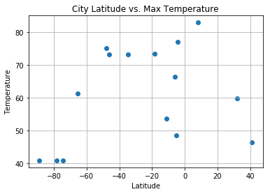
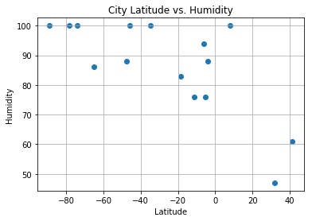
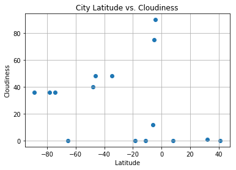
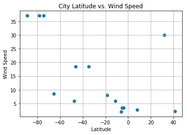

```python
# Dependencies
import json
from numpy import random
import requests
import matplotlib.pyplot as plt
import pandas as pd
import numpy as np
from citipy import citipy
from config import openweather_key
```


```python
lat = np.random.uniform(low=-90.000, high=90.000, size=1500)
lon = np.random.uniform(low=-180.000, high=180.000, size=1500)
```


```python
coords = {"Lat": lat, "Lng": lon}
df = pd.DataFrame(coords)
```


```python
new_df = df.sample(n=15)
new_df.head()
```


<div>
<style>
    .dataframe thead tr:only-child th {
        text-align: right;
    }

    .dataframe thead th {
        text-align: left;
    }

    .dataframe tbody tr th {
        vertical-align: top;
    }
</style>
<table border="1" class="dataframe">
  <thead>
    <tr style="text-align: right;">
      <th></th>
      <th>Lat</th>
      <th>Lng</th>
    </tr>
  </thead>
  <tbody>
    <tr>
      <th>422</th>
      <td>-74.275300</td>
      <td>-93.193371</td>
    </tr>
    <tr>
      <th>756</th>
      <td>-11.179222</td>
      <td>28.326064</td>
    </tr>
    <tr>
      <th>1225</th>
      <td>-4.143961</td>
      <td>2.975275</td>
    </tr>
    <tr>
      <th>1433</th>
      <td>-88.910945</td>
      <td>-92.555193</td>
    </tr>
    <tr>
      <th>1059</th>
      <td>-46.090121</td>
      <td>-114.734815</td>
    </tr>
  </tbody>
</table>
</div>


```python
new_df = new_df.reset_index(drop=True)
new_df.head()
```


<div>
<style>
    .dataframe thead tr:only-child th {
        text-align: right;
    }

    .dataframe thead th {
        text-align: left;
    }

    .dataframe tbody tr th {
        vertical-align: top;
    }
</style>
<table border="1" class="dataframe">
  <thead>
    <tr style="text-align: right;">
      <th></th>
      <th>Lat</th>
      <th>Lng</th>
    </tr>
  </thead>
  <tbody>
    <tr>
      <th>0</th>
      <td>-74.275300</td>
      <td>-93.193371</td>
    </tr>
    <tr>
      <th>1</th>
      <td>-11.179222</td>
      <td>28.326064</td>
    </tr>
    <tr>
      <th>2</th>
      <td>-4.143961</td>
      <td>2.975275</td>
    </tr>
    <tr>
      <th>3</th>
      <td>-88.910945</td>
      <td>-92.555193</td>
    </tr>
    <tr>
      <th>4</th>
      <td>-46.090121</td>
      <td>-114.734815</td>
    </tr>
  </tbody>
</table>
</div>


```python
coordinates = tuple(zip(new_df["Lat"], new_df["Lng"]))
coordinates
```


    ((-74.275300121217157, -93.193370986615889),
     (-11.179222385108687, 28.326064364983807),
     (-4.1439610954130757, 2.9752753578886484),
     (-88.910945352665976, -92.55519318957181),
     (-46.090121016095253, -114.73481513679735),
     (32.017375137410909, -100.04180172320022),
     (-6.2589420184359028, 136.76082544978112),
     (-5.2108796731032356, 63.594251358776063),
     (-18.491976578857162, 119.12522823658725),
     (-34.898312834191096, -116.86226932324479),
     (41.091937704940904, -3.6306314013070278),
     (-65.298072588773934, -160.00753366856026),
     (8.1130429207303649, 64.074250409099022),
     (-78.389379945468676, -120.3126030645229),
     (-47.716473045377576, 71.176619912361872))


```python
cities = []
city_name = []
for coordinate_pair in coordinates:
    lat, lon = coordinate_pair
    cities.append(citipy.nearest_city(lat, lon))

for city in cities:
    country_code = city.country_code
    name = city.city_name
    city_name.append(name)
```


```python
new_df["City_Name"] = city_name
new_df.head()
```


<div>
<style>
    .dataframe thead tr:only-child th {
        text-align: right;
    }

    .dataframe thead th {
        text-align: left;
    }

    .dataframe tbody tr th {
        vertical-align: top;
    }
</style>
<table border="1" class="dataframe">
  <thead>
    <tr style="text-align: right;">
      <th></th>
      <th>Lat</th>
      <th>Lng</th>
      <th>City_Name</th>
    </tr>
  </thead>
  <tbody>
    <tr>
      <th>0</th>
      <td>-74.275300</td>
      <td>-93.193371</td>
      <td>punta arenas</td>
    </tr>
    <tr>
      <th>1</th>
      <td>-11.179222</td>
      <td>28.326064</td>
      <td>mansa</td>
    </tr>
    <tr>
      <th>2</th>
      <td>-4.143961</td>
      <td>2.975275</td>
      <td>port-gentil</td>
    </tr>
    <tr>
      <th>3</th>
      <td>-88.910945</td>
      <td>-92.555193</td>
      <td>punta arenas</td>
    </tr>
    <tr>
      <th>4</th>
      <td>-46.090121</td>
      <td>-114.734815</td>
      <td>rikitea</td>
    </tr>
  </tbody>
</table>
</div>


```python
# OpenWeather config info
url = "http://api.openweathermap.org/data/2.5/weather?"
units = "imperial"
```


```python
# Create empty column for desired data
new_df["Temperature"] = ""
new_df["Humidity"] = ""
new_df["Cloudiness"] = ""
new_df["Wind_Speed"] = ""
units = "imperial"
weather_data = []

# Counter
row_count = 0

# Loop through and run Google search to get all banks in 5 mile radius (8000 meters)
for index, row in new_df.iterrows():
    
    # Create endpoint url using Google Places Radar and the lat/lng we identified earlier
    target_url = url + "appid=" + openweather_key + "&units=" + units + "&q=" + str(new_df.loc[index]["City_Name"])

    # This link helps to handily see the JSON generated for each query
    print("Now retrieving city #%s: %s" % (row_count, new_df.loc[index]["City_Name"]))
    row_count += 1 
    print(target_url)
    
    # Run a request to grab the JSON at the target URL
    response = requests.get(target_url).json()
    weather_data.append(response)
    
    # Extract interesting data from responses
    temp_data = [data.get("main").get("temp") for data in weather_data]
    humidity_data = [data.get("main").get("humidity") for data in weather_data]
    cloud_data = [data.get("clouds").get("all") for data in weather_data]
    wind_data = [data.get("wind").get("speed") for data in weather_data]

    
    # Store the bank count into the Data Frame
    new_df.set_value(index, "Temperature", temp_data[-1])
    new_df.set_value(index, "Humidity", humidity_data[-1])
    new_df.set_value(index, "Cloudiness", cloud_data[-1])
    new_df.set_value(index, "Wind_Speed", wind_data[-1])

    # Reset Counts
    temp_data = []
    humidity_data = []
    cloud_data = []
    wind_data = []
    
# Visualize
new_df.head()
```

    Now retrieving city #0: punta arenas
    http://api.openweathermap.org/data/2.5/weather?appid=480f9c5d42614026ec8d262bdebe16c9&units=imperial&q=punta arenas
    Now retrieving city #1: mansa
    http://api.openweathermap.org/data/2.5/weather?appid=480f9c5d42614026ec8d262bdebe16c9&units=imperial&q=mansa
    Now retrieving city #2: port-gentil
    http://api.openweathermap.org/data/2.5/weather?appid=480f9c5d42614026ec8d262bdebe16c9&units=imperial&q=port-gentil
    Now retrieving city #3: punta arenas
    http://api.openweathermap.org/data/2.5/weather?appid=480f9c5d42614026ec8d262bdebe16c9&units=imperial&q=punta arenas
    Now retrieving city #4: rikitea
    http://api.openweathermap.org/data/2.5/weather?appid=480f9c5d42614026ec8d262bdebe16c9&units=imperial&q=rikitea
    Now retrieving city #5: abilene
    http://api.openweathermap.org/data/2.5/weather?appid=480f9c5d42614026ec8d262bdebe16c9&units=imperial&q=abilene
    Now retrieving city #6: nabire
    http://api.openweathermap.org/data/2.5/weather?appid=480f9c5d42614026ec8d262bdebe16c9&units=imperial&q=nabire
    Now retrieving city #7: victoria
    http://api.openweathermap.org/data/2.5/weather?appid=480f9c5d42614026ec8d262bdebe16c9&units=imperial&q=victoria
    Now retrieving city #8: port hedland
    http://api.openweathermap.org/data/2.5/weather?appid=480f9c5d42614026ec8d262bdebe16c9&units=imperial&q=port hedland
    Now retrieving city #9: rikitea
    http://api.openweathermap.org/data/2.5/weather?appid=480f9c5d42614026ec8d262bdebe16c9&units=imperial&q=rikitea
    Now retrieving city #10: colmenar viejo
    http://api.openweathermap.org/data/2.5/weather?appid=480f9c5d42614026ec8d262bdebe16c9&units=imperial&q=colmenar viejo
    Now retrieving city #11: mataura
    http://api.openweathermap.org/data/2.5/weather?appid=480f9c5d42614026ec8d262bdebe16c9&units=imperial&q=mataura
    Now retrieving city #12: kavaratti
    http://api.openweathermap.org/data/2.5/weather?appid=480f9c5d42614026ec8d262bdebe16c9&units=imperial&q=kavaratti
    Now retrieving city #13: punta arenas
    http://api.openweathermap.org/data/2.5/weather?appid=480f9c5d42614026ec8d262bdebe16c9&units=imperial&q=punta arenas
    Now retrieving city #14: souillac
    http://api.openweathermap.org/data/2.5/weather?appid=480f9c5d42614026ec8d262bdebe16c9&units=imperial&q=souillac
    


<div>
<style>
    .dataframe thead tr:only-child th {
        text-align: right;
    }

    .dataframe thead th {
        text-align: left;
    }

    .dataframe tbody tr th {
        vertical-align: top;
    }
</style>
<table border="1" class="dataframe">
  <thead>
    <tr style="text-align: right;">
      <th></th>
      <th>Lat</th>
      <th>Lng</th>
      <th>City_Name</th>
      <th>Temperature</th>
      <th>Humidity</th>
      <th>Cloudiness</th>
      <th>Wind_Speed</th>
    </tr>
  </thead>
  <tbody>
    <tr>
      <th>0</th>
      <td>-74.275300</td>
      <td>-93.193371</td>
      <td>punta arenas</td>
      <td>40.83</td>
      <td>100</td>
      <td>36</td>
      <td>37.02</td>
    </tr>
    <tr>
      <th>1</th>
      <td>-11.179222</td>
      <td>28.326064</td>
      <td>mansa</td>
      <td>53.65</td>
      <td>76</td>
      <td>0</td>
      <td>5.93</td>
    </tr>
    <tr>
      <th>2</th>
      <td>-4.143961</td>
      <td>2.975275</td>
      <td>port-gentil</td>
      <td>77</td>
      <td>88</td>
      <td>90</td>
      <td>3.36</td>
    </tr>
    <tr>
      <th>3</th>
      <td>-88.910945</td>
      <td>-92.555193</td>
      <td>punta arenas</td>
      <td>40.83</td>
      <td>100</td>
      <td>36</td>
      <td>37.02</td>
    </tr>
    <tr>
      <th>4</th>
      <td>-46.090121</td>
      <td>-114.734815</td>
      <td>rikitea</td>
      <td>73.18</td>
      <td>100</td>
      <td>48</td>
      <td>18.45</td>
    </tr>
  </tbody>
</table>
</div>


```python
# Build a scatter plot for each data type
plt.scatter(new_df["Lat"], new_df["Temperature"], marker="o")

# Incorporate the other graph properties
plt.title("City Latitude vs. Max Temperature")
plt.ylabel("Temperature")
plt.xlabel("Latitude")
plt.grid(True)


# Show plot
plt.show()
```





```python
# Build a scatter plot for each data type
plt.scatter(new_df["Lat"], new_df["Humidity"], marker="o")

# Incorporate the other graph properties
plt.title("City Latitude vs. Humidity")
plt.ylabel("Humidity")
plt.xlabel("Latitude")
plt.grid(True)


# Show plot
plt.show()
```





```python
# Build a scatter plot for each data type
plt.scatter(new_df["Lat"], new_df["Cloudiness"], marker="o")

# Incorporate the other graph properties
plt.title("City Latitude vs. Cloudiness")
plt.ylabel("Cloudiness")
plt.xlabel("Latitude")
plt.grid(True)


# Show plot
plt.show()
```





```python
# Build a scatter plot for each data type
plt.scatter(new_df["Lat"], new_df["Wind_Speed"], marker="o")

# Incorporate the other graph properties
plt.title("City Latitude vs. Wind Speed")
plt.ylabel("Wind Speed")
plt.xlabel("Latitude")
plt.grid(True)


# Show plot
plt.show()
```




